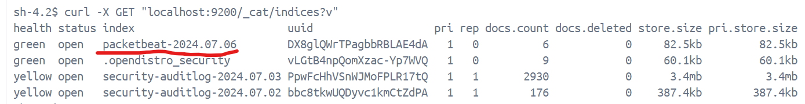
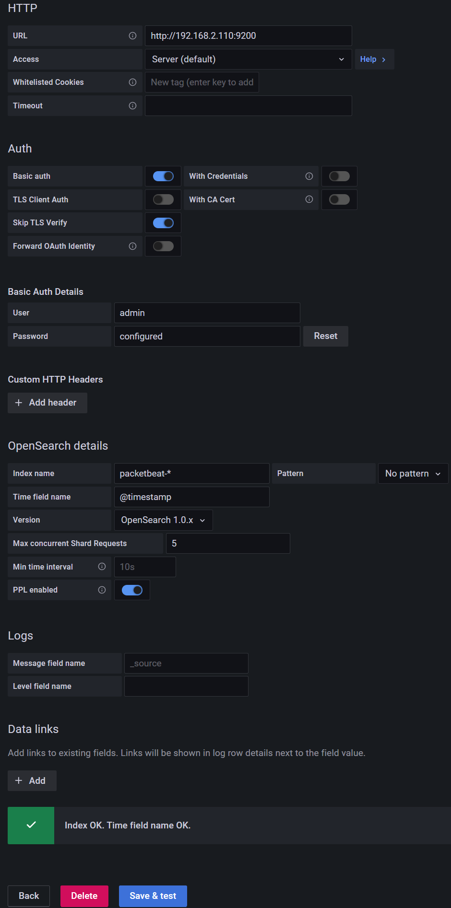

# 도커 네트워크 트래픽 로그 수집 및 모니터링 (OpenSearch, Logstash, Packetbeat, Docker, ~~Grafana~~, OpenSearch Dashboard) 

## Overview
1. Packetbeat로 도커 네트워크 트래픽을 수집하고   
2. Logstash로 로그를 처리하고 전달합니다.  
3. OpenSearch가 로그를 저장/인덱스  
4. Grafana(보류) ~~datasource 추가는 했지만 opensearch datasource를 기반으로 한 대시보드 라이브러리가 없어서 grafana는 포기~~
5.  OpenSearch 대시보드

## Troubleshooting 
* https://forum.opensearch.org/t/error-when-starting-a-single-node-opensearch-on-docker/6645/9  
Exception during establishing a SSL connection: io.netty.handler.ssl.NotSslRecordException: not an SSL/TLS record  
opensearch ssl 관련 로그  

* https://stackoverflow.com/questions/51871798/packetbeat-not-able-to-connect-to-elasticsearch-docker  
network_mode: "host" 사용시 컨테이너명(opensearch:9200)으로 접근 불가, http://your-host-ip:9200으로 바꿔야 함  

* https://github.com/elastic/beats/issues/25865  
OSS 버전 문제  

* https://docs.aws.amazon.com/ko_kr/opensearch-service/latest/developerguide/rename.html  
OpenSearch는 Elasticsearch OSS 클라이언트(beat 들) 호환성 체크 해줘야 함  

* https://stackoverflow.com/questions/74042827/aws-grafana-connecting-to-aws-opensearch-opensearch-error-bad-gateway  
grafana에서 data source로 OpenSearch 설정시 참고  

* https://discuss.elastic.co/t/indices-not-creating-after-logstah-starting-with-systemctl-service/304871/22?page=2  
```
DEPRECATION WARNING: Connecting to an OSS distribution of Elasticsearch using the default distribution of Logstash will stop working in Logstash 8.0.0. Please upgrade to the default distribution of Elasticsearch, or use the OSS distribution of Logstash {:url=>"http://localhost"}
```
Logstash 버전 문제 아래 표 참고하여 해결

* https://groups.google.com/g/wazuh/c/-3rL7zv1raA/m/_RVW-XVtBgAJ
위에 여러 버전 문제들로 해결이 안되는 경우 (beat)oss를 수동으로 설치해서 해결하는 경우도 있음  
참고로 저는 위에 버전 호환성 문제들 다 안돼서 이 방법으로 해결했어요

### > 버전 호환성 표 <
* https://www.elastic.co/de/support/matrix#matrix_compatibility  
(ES 7.10.x) 참고할 것  

### 빌드 성공 여부
  
packetbeat 인덱스가 자동으로 만들어 졌는지 확인 필요

### > 부가 자료 <
* https://discuss.elastic.co/t/filebeat-and-glibc-errors-on-ubuntu-22-04/306653/2  
혹시 파일비트 사용시 참고할 것 (glibc)  

## How to set up a data source on the Grafana

데이터 소스 추가는 했지만 오픈서치 데이터 소스를 기반으로 한 대시보드 라이브러리가 없어서 grafana는 포기  

